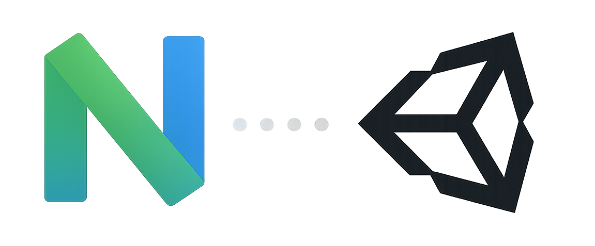

# c-unity.nvim

<div align="center">

[](http://www.lua.org)
[](https://neovim.io)




</div>

**Disclaimer:** This project is currently under development. Features may be incomplete or subject to change. This README file was generated by an LLM.

Tired of switching between Unity and Neovim? This plugin aims to streamline your C# development workflow in Unity by bringing Unity logs and compilation commands directly into Neovim.

## Features

-   **Automatic Connection:** Automatically detects a Unity project in the current directory and attempts to connect to the Unity Editor. The connection is re-established automatically if it's lost.
-   **View Unity Logs:** View logs from Unity in a floating window inside Neovim.
-   **Syntax Highlighting:** Custom syntax highlighting for Unity logs, with support for warnings and errors.
-   **Recompile Command:** Send a recompile command to Unity directly from Neovim.
-   **Customizable Window:** The log window can be customized (border, size, etc.).
-   **Debug Mode:** Enable debug notifications for troubleshooting.

## Dependencies

This plugin requires the accompanying [plugin](https://github.com/trueGmek/com.gmek.c-unity) to be running in your Unity project.

## Installation

You can install this plugin using your favorite plugin manager.

### Packer

```lua
use {
    "gmek/c-unity.nvim",
    config = function()
          local plugin = require("c-unity")
          plugin.setup({ debug = false, unity = { path = "~/Unity/Hub/Editor/" } })

          vim.api.nvim_create_user_command('CUOpen', plugin.editor.open_project, { desc = "Open Unity Project" })
          vim.api.nvim_create_user_command('CULogs', plugin.window.toggle, { desc = "Toggle logs window" })
          vim.api.nvim_create_user_command('CUClear', plugin.window.clear_buffer, { desc = 'Clear logs' })
          vim.api.nvim_create_user_command('CUBuild', plugin.pipe.send_recomipile, { desc = "Send recompile command" })
          vim.api.nvim_create_user_command('CUConnect', plugin.pipe.setup_connection, { desc = "Connect to Unity Server" })
          vim.api.nvim_create_user_command('CUDisconnect', plugin.pipe.disconnect_from_unity,
            { desc = "Disconnect from Unity Server" })
    end
}
```

## Configuration

The `setup` function can be called with a configuration table to override the default settings.

```lua
require("c-unity").setup({
    debug = false, -- Enable debug notifications
    loop = { -- Connection loop settings
        timeout = 1000, -- Timeout in milliseconds for each connection attempt
        repeat_time = 1000, -- Time in milliseconds between connection attempts
        limit = 100 -- Maximum number of connection attempts
    },
    connection = { -- Pipe names
        server_read_pipe_name = "/tmp/unity-pipe-read",
        server_write_pipe_name = "/tmp/unity-pipe-write"
    },
    window = { -- Log window settings
        filetype = "cunitylog",
        border = "rounded",
        style = "minimal",
        relative = "editor",
        width_perct = 0.8,
        height_perct = 0.8,
    },
    unity = { -- Unity editor settings
        path = "/path/to/your/unity/hub/or/editor" -- Path to the Unity executable
    }
})
```

## Usage

The plugin automatically detects a Unity project by looking for `Assets` and `ProjectSettings` directories. Once a project is detected, it will attempt to connect to the Unity Editor. This check is also performed every time you change a directory.

### Commands

| Command        | Description                     |
| -------------- | ------------------------------- |
| `:CUConnect`   | Manually connect to the Unity Editor.    |
| `:CUDisconnect`| Disconnect from the Unity Editor. |
| `:CUBuild`     | Send a recompile command to Unity.       |
| `:CULog`       | Toggle the log window.          |
| `:CULogs`      | Alias for `:CULog`.          |
| `:CUClear`     | Clear the log window.           |
| `:CUOpen`      | Open the Unity project.         |

## How it Works

This plugin communicates with the Unity Editor using named pipes. The Unity plugin creates two named pipes, one for reading and one for writing. The Neovim plugin then connects to these pipes to send and receive messages.

The communication protocol is based on JSON messages. The Neovim plugin sends commands to Unity (e.g., to recompile the project), and the Unity plugin sends logs and other information back to Neovim.

## Contributing

Contributions are welcome! Please feel free to open an issue or submit a pull request.

## License

This project is licensed under the MIT License. See the [LICENSE](LICENSE) file for details.
